# Assignment 2

## 1. Write a script that adds a user-defined prefix or suffix to all files in a directory.

### Script:

```bash
#!/bin/bash

read -p "Enter target directory: " directory

if [[ ! -d "$directory" ]]; then
    echo "Error: Directory does not exist."
    exit 1
fi

read -p "Enter prefix : " prefix
read -p "Enter suffix : " suffix

for file in "$directory"/*; do
    [[ -e "$file" ]] || continue

    if [[ -d "$file" ]]; then
        continue
    fi

    filename=$(basename "$file")
    name="${filename%.*}"
    ext="${filename##*.}"

    if [[ "$filename" == "$ext" ]]; then
        newname="${prefix}${name}${suffix}"
    else
        newname="${prefix}${name}${suffix}.${ext}"
    fi

    mv "$file" "$directory/$newname"
    echo "Renamed: $filename → $newname"
done

echo "Done!"
```

### Output:
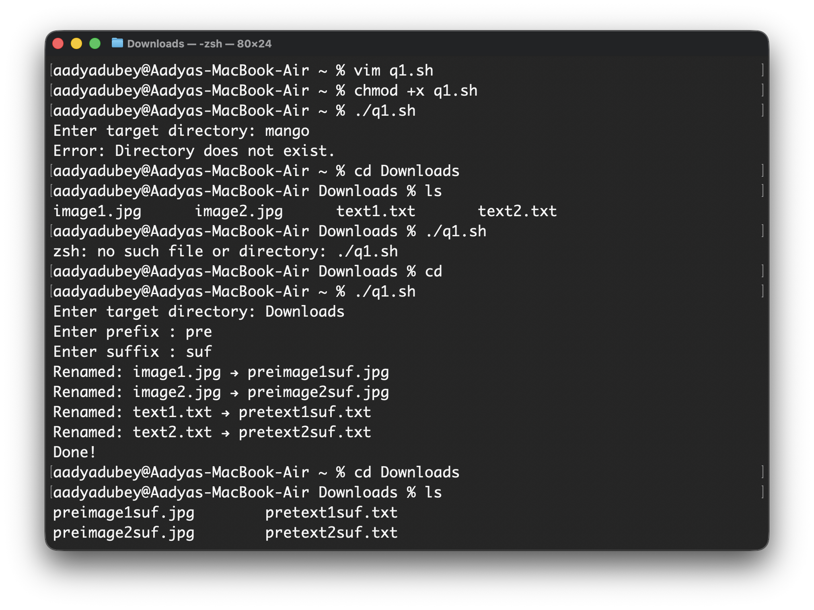
## 2. Search recursively for files with a given extension or larger than a specified size.

### Commands used:
* `find /path/to/search -type f -name "*.<file_extension>"` : To search recursively for files with a given extension.
*  `find /path/to/search -type f -size +<value><unit>` : To search recursively for files larger than a specified size.  
Here unit can be:
	*  k → kilobytes
	*	M → megabytes
	*	G → gigabytes
* `find . -type f -name "*.<file_extension>" -size +<value><unit>` : To search recursively for files with a given extension and larger than a specified size.

### Output:
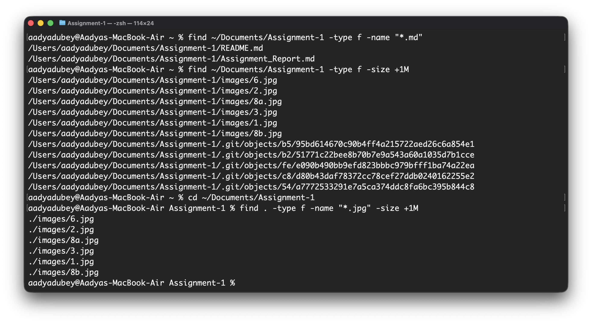
## 3. Generate Fibonacci series up to a given
### Script:
```bash
#!/bin/bash

read -p "Enter limit: " n

a=0
b=1

for (( i=0; i<n; i++ ))
do
    echo -n "$a "
    fn=$((a + b))
    a=$b
    b=$fn
done

echo
```

### Output:
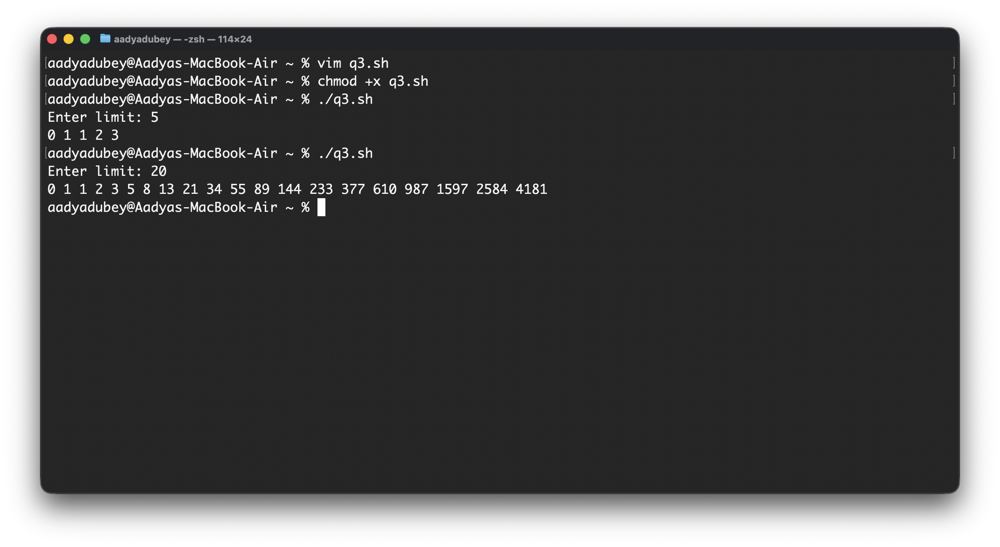
## 4. Check if a file is readable, writable, or executable by the user.
### Script:
```bash
#!/bin/bash

read -p "Enter file name: " file

if [[ ! -e "$file" ]]; then
    echo "Error: File does not exist."
    exit 1
fi

if [[ -r "$file" ]]; then
    echo "Readable: YES"
else
    echo "Readable: NO"
fi

if [[ -w "$file" ]]; then
    echo "Writable: YES"
else
    echo "Writable: NO"
fi

if [[ -x "$file" ]]; then
    echo "Executable: YES"
else
    echo "Executable: NO"
fi
```
### Output:
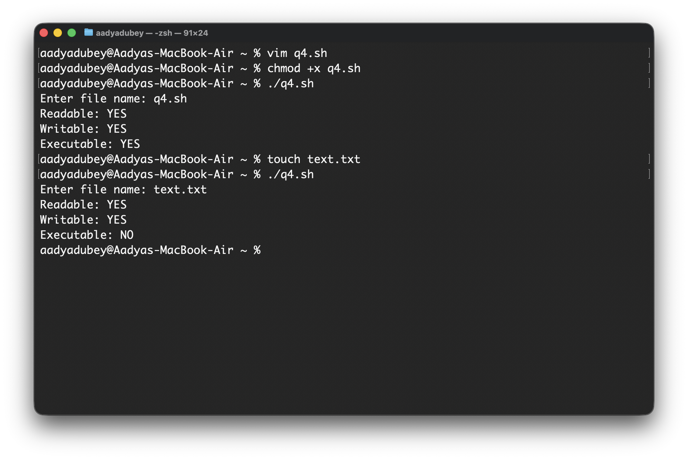
## 5. Display system information (date, uptime, users, memory, disk usage).
### Script:
```bash
#!/bin/bash

echo "SYSTEM INFORMATION:"

echo -e "\n Date & Time:"
date

echo -e "\n Uptime:"
uptime -p

echo -e "\n Logged-in Users:"
who

echo -e "\n Memory Usage:"
free -h

echo -e "\n Disk Usage:"
df -h
```
### Output:
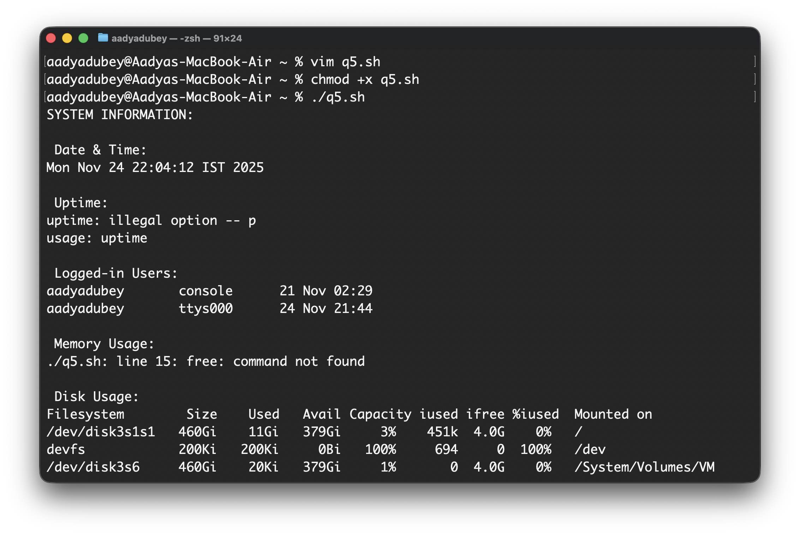
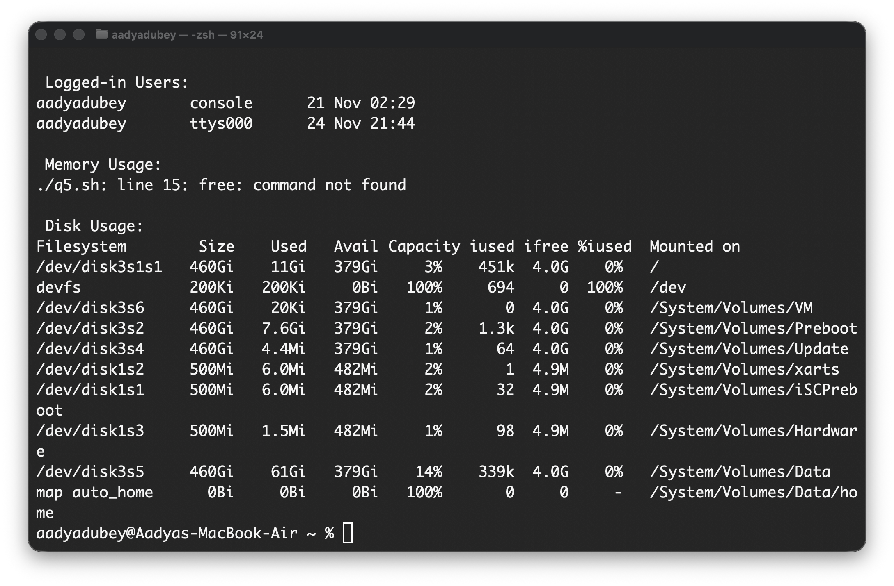

## 6. Continuously monitor and log top memory-consuming processes.
### Script:
```bash
#!/bin/bash

LOGFILE="memory_log.txt"
INTERVAL=5 
TOP=10

echo "Starting memory monitor..."
echo "Logging top $TOP memory-consuming processes every $INTERVAL seconds."
echo "Log file: $LOGFILE"
echo "--------------------------------------------" >> $LOGFILE

while true
do
    echo -e "\n===== $(date) =====" >> $LOGFILE
    ps aux --sort=-%mem | head -n $((TOP + 1)) >> $LOGFILE
    echo "Logged at $(date)"
    sleep $INTERVAL
done
```
### Output:
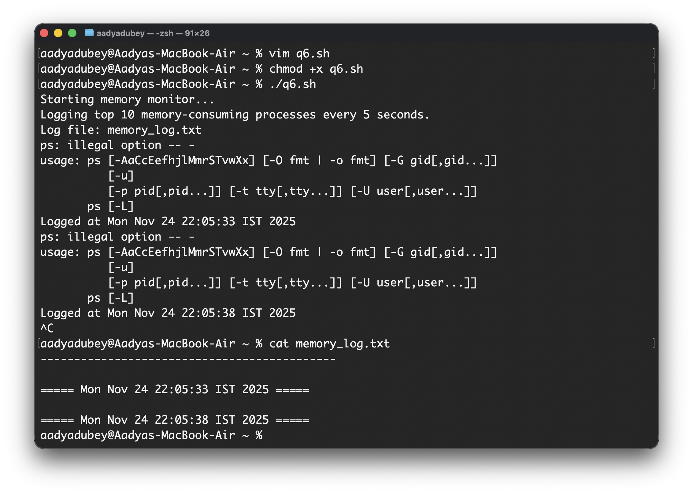
## 7. Take a filename as input and display the number of lines, words, and characters.
### Script:
```bash
#!/bin/bash

read -p "Enter filename: " file

if [[ ! -f "$file" ]]; then
    echo "Error: File does not exist."
    exit 1
fi

lines=$(wc -l < "$file")
words=$(wc -w < "$file")
chars=$(wc -m < "$file")

echo "File: $file"
echo "Lines: $lines"
echo "Words: $words"
echo "Characters: $chars"
```
### Output:
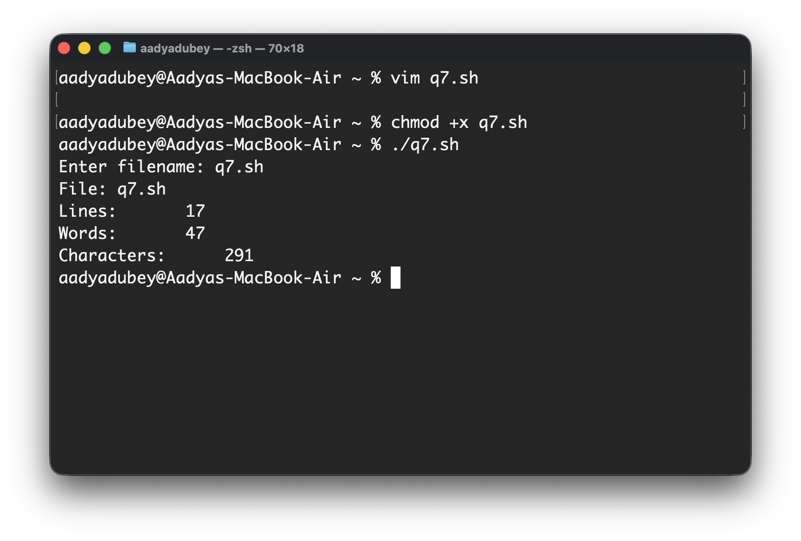
## 8. Accept multiple numbers and sort them in ascending order.
### Script:
```bash
#!/bin/bash

read -p "Enter numbers separated by spaces: " -a nums

sorted=$(printf "%s\n" "${nums[@]}" | sort -n)

echo "Sorted numbers (ascending):"
echo "$sorted"
```
### Output:
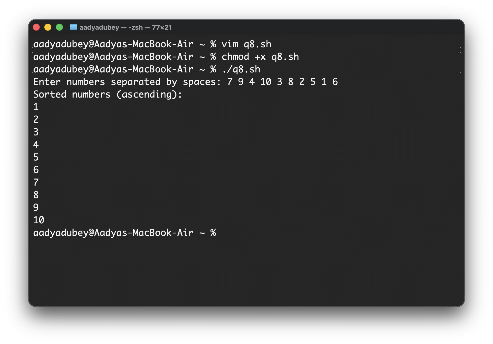
## 9. Calculate the GCD and LCM of two given numbers.
### Script:
```bash
#!/bin/bash

read -p "Enter first number: " a
read -p "Enter second number: " b

if ! [[ "$a" =~ ^[0-9]+$ ]] || ! [[ "$b" =~ ^[0-9]+$ ]]; then
    echo "Error: Please enter valid positive integers."
    exit 1
fi

gcd() {
    x=$1
    y=$2
    while [ $y -ne 0 ]; do
        r=$((x % y))
        x=$y
        y=$r
    done
    echo $x
}

lcm() {
    x=$1
    y=$2
    echo $(( (x * y) / $(gcd $x $y) ))
}

GCD=$(gcd $a $b)
LCM=$(lcm $a $b)

echo "GCD of $a and $b is: $GCD"
echo "LCM of $a and $b is: $LCM"
```
### Output:
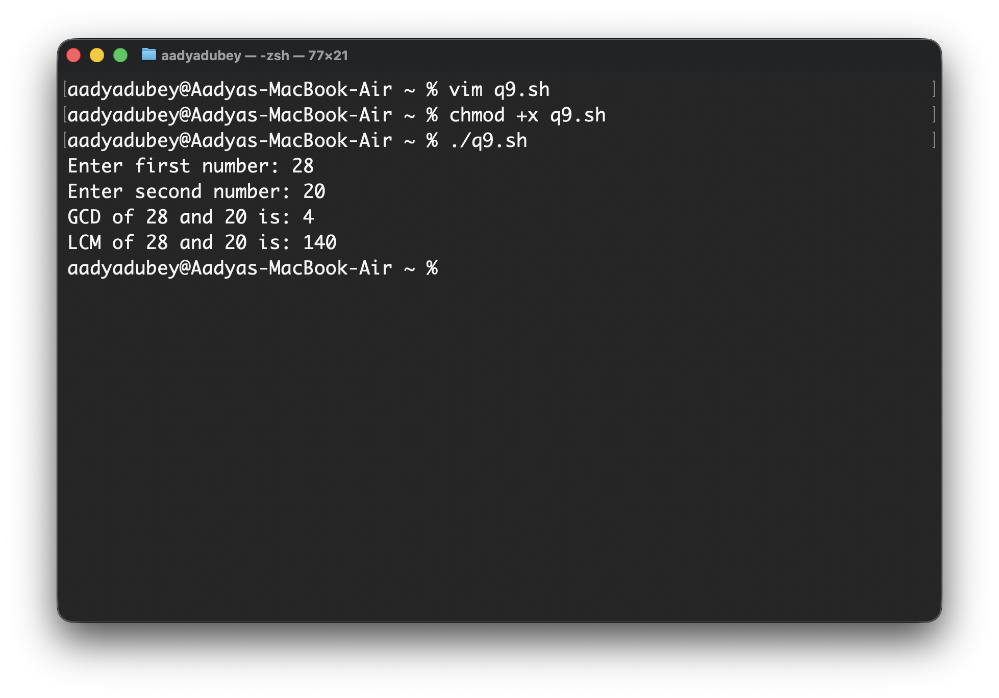
## 10. Check whether an entered string is a palindrome or not.
### Script:
```bash
#!/bin/bash

read -p "Enter a string: " str

clean_str=$(echo "$str" | tr -d ' ' | tr '[:upper:]' '[:lower:]')

rev_str=$(echo "$clean_str" | rev)

if [ "$clean_str" == "$rev_str" ]; then
    echo "\"$str\" is a palindrome."
else
    echo "\"$str\" is not a palindrome."
fi
```
### Output:
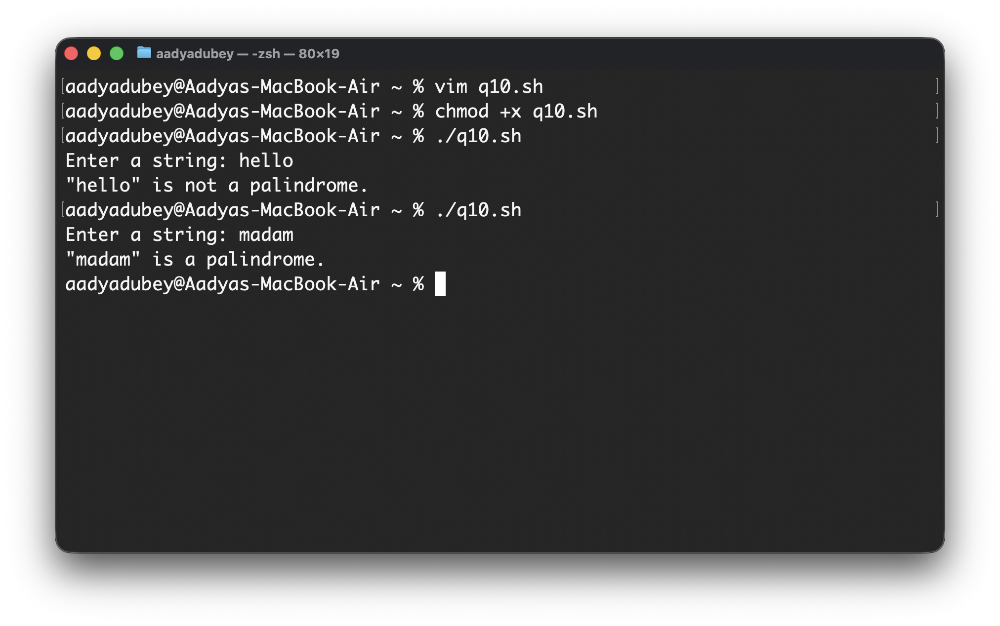
## 11. Calculate and display the length of a string.
### Script:
```bash
#!/bin/bash

read -p "Enter a string: " str

length=${#str}

echo "The length of the string is: $length"
```
### Output:
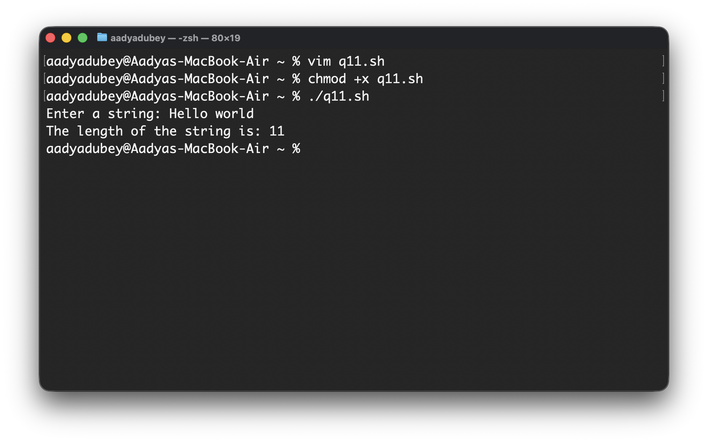
## 12. Reverse a given string.
### Script:
```bash
#!/bin/bash

read -p "Enter a string: " str

rev_str=$(echo "$str" | rev)

echo "Reversed string: $rev_str"
```
### Output:
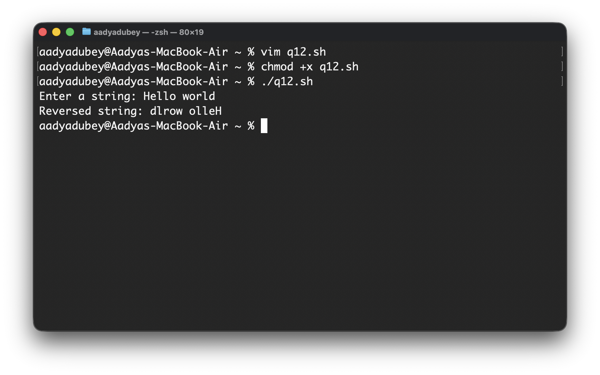

## 13. Concatenate two input strings.
### Script:
```bash
#!/bin/bash

read -p "Enter first string: " str1

read -p "Enter second string: " str2

concat="$str1$str2"

echo "Concatenated string: $concat"
```
### Output:
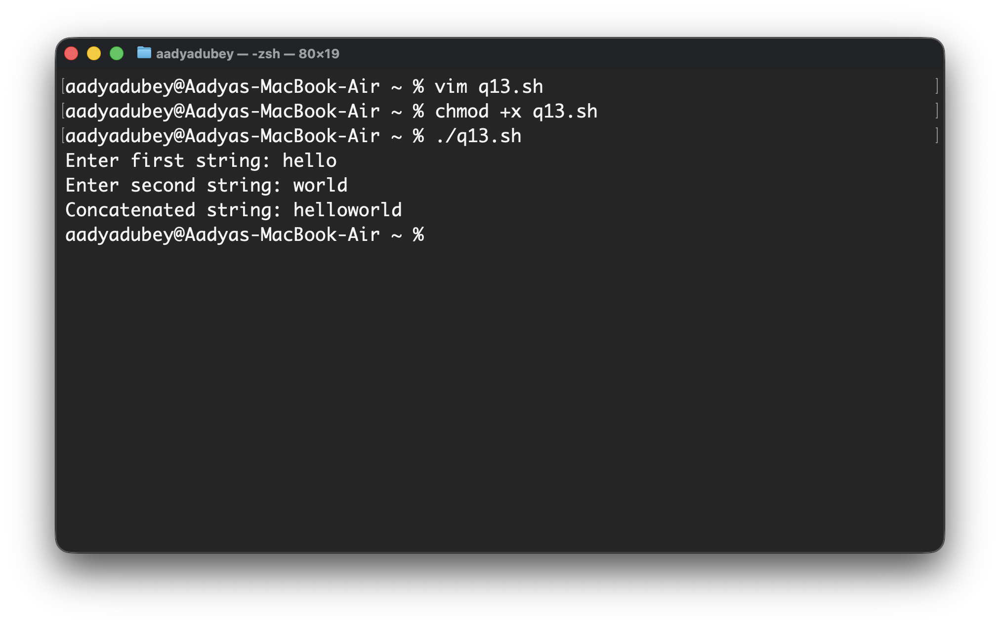
